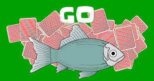

## Welcome to Go Fish Project



Developers : JunJie Wu, Justin Pao, Kenton

### Game Design:

Markdown is a lightweight and easy-to-use syntax for styling your writing. It includes conventions for

THE PACK
 
The standard 52-card pack is used. Some cards will be dealt and the rest will form the stock pile.

OBJECT OF THE GAME

The goal is to win the most "books" of cards. A book is any four of a kind, such as four kings, four aces, and so on.
 
RANK OF CARDS
 
The cards rank from ace (high) to two (low). The suits are not important, only the card numbers are relevant, such as two 3s, two 10s, and so on.

THE DEAL
 
Any player deals one card face up to each player. The player with the lowest card is the dealer. The dealer shuffles the cards, and the player to the right cuts them.The dealer completes the cut and deals the cards clockwise one at a time, face down, beginning with the player to the left. If two or three people are playing, each player receives seven cards. If four or five people are playing, each receives five cards. The remainder of the pack is placed face down on the table to form the stock.
 
THE PLAY
 
The player to the left of the dealer looks directly at any opponent and says, for example, "Give me your kings," usually addressing the opponent by name and specifying the rank that they want, from ace down to two. The player who is "fishing “must have at least one card of the rank that was asked for in their hand. The player who is addressed must hand over all the cards requested. If the player has none, they say, "Go fish!" and the player who made the request draws the top card of the stock and places it in their hand.

If a player gets one or more cards of the named rank that was asked for, they are entitled to ask the same or another player for a card. The player can ask for the same card or a different one. So long as the player succeeds in getting cards (makes a catch), their turn continues. When a player makes a catch, they must reveal the card so that the catch is verified. If a player gets the fourth card of a book, the player shows all four cards, places them on the table face up in front of everyone, and plays again.
 
If the player goes fishing without "making a catch" (does not receive a card he asked for), the turn passes to the left.The game ends when all thirteen books have been won. The winner is the player with the most books. During the game, if a player is left without cards, they may (when it's their turn to play), draw from the stock and then ask for cards of that rank. If there are no cards left in the stock, they are out of the game.


<button class="medioButton" onclick="clickA(this)">播放/暂停</button>
# Header 1
## Header 2
### Header 3

- Bulleted
- List

1. Numbered
2. List

**Bold** and _Italic_ and `Code` text

[Link](url) and 
```

For more details see [GitHub Flavored Markdown](https://guides.github.com/features/mastering-markdown/).

### Jekyll Themes

Your Pages site will use the layout and styles from the Jekyll theme you have selected in your [repository settings](https://github.com/junjiewu1995/CSC466-Go-Fish-Project/settings). The name of this theme is saved in the Jekyll `_config.yml` configuration file.

### Support or Contact

Having trouble with Pages? Check out our [documentation](https://docs.github.com/categories/github-pages-basics/) or [contact support](https://support.github.com/contact) and we’ll help you sort it out.
